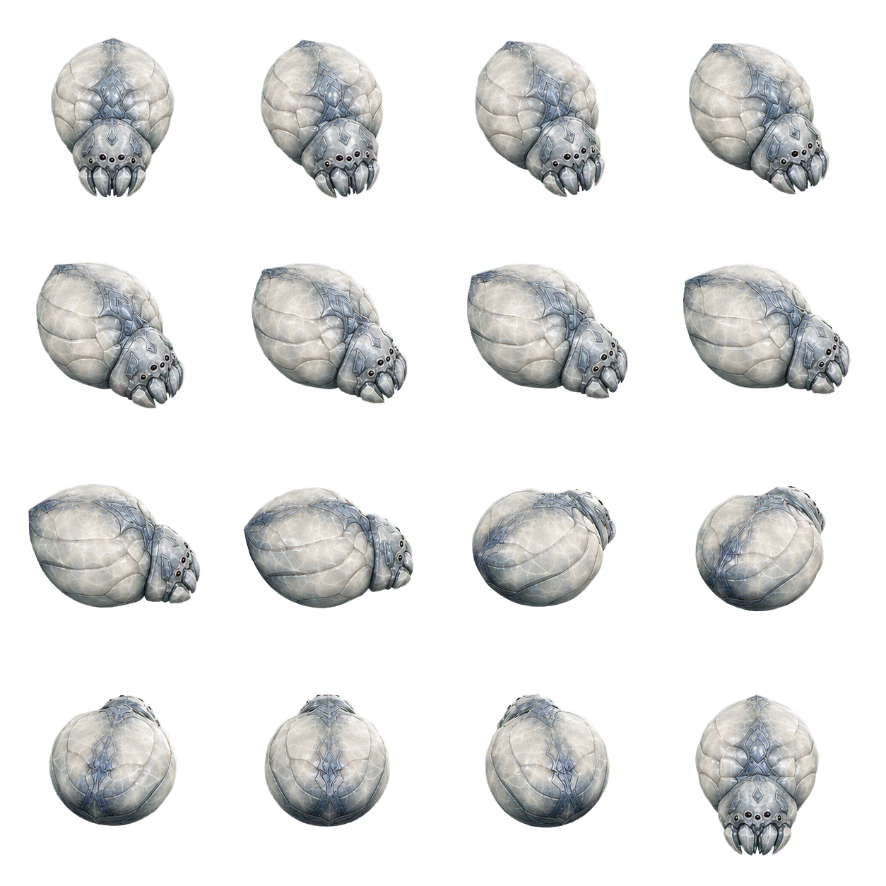

<div align="center">

<p><a href="README.md">简体中文</a> · <strong>English</strong></p>

<h1>Honey</h1>
<p><strong>A white jade spider companion living on your Windows desktop</strong></p>

<p>
  <a href="https://github.com/vectorxxxx/20260724-honey/releases/latest"></a>
  <a href="https://github.com/vectorxxxx/20260724-honey/releases"></a>
  
  
  <a href="LICENSE"></a>
</p>

<p>
  <a href="https://github.com/vectorxxxx/20260724-honey/releases/latest/download/Honey.exe"><strong>Download Honey</strong></a>
  ·
  <a href="https://github.com/vectorxxxx/20260724-honey/releases">Release notes</a>
</p>



</div>

## Features

- Lives autonomously: observes, explores, eats, plays, grooms, and sleeps
- Responds to the pointer, dragging, petting, and the radial skill menu
- Switches between white jade and berserk black jade forms
- Includes tray controls, focus mode, and personality settings
- Works fully offline; optional AI personality is disabled by default

`C# 14` · `.NET 10` · `WPF` · `SkiaSharp` · `SQLite`

## Quick start

1. Download `Honey.exe`.
2. Run it. Honey appears near the lower-right corner of your desktop.
3. Click Honey to open the skill menu, or drag it to a new position.
4. Use the Honey tray menu to change settings or exit.

> Requires Windows 11 x64. `Honey.exe` is a self-contained single file; no .NET installation is required.

Closing the settings window does not quit Honey. Exit from the tray menu, or run:

```powershell
.\Honey.exe --shutdown
```

## Commands

| Command | Description |
| --- | --- |
| `.\Honey.exe --show` | Start or reveal Honey |
| `.\Honey.exe --background` | Start in the background |
| `.\Honey.exe --shutdown` | Save state and exit |
| `.\Honey.exe --verify-data` | Verify local data |
| `.\Honey.exe --show --data-root "D:\HoneyData"` | Use a custom data directory |

## Build from source

Install Git and the .NET 10 SDK on a new Windows machine:

```powershell
winget install --id Git.Git -e --source winget
winget install --id Microsoft.DotNet.SDK.10 -e --source winget
```

Open a new PowerShell window, then run:

```powershell
git clone https://github.com/vectorxxxx/20260724-honey.git
Set-Location .\20260724-honey
powershell -NoProfile -ExecutionPolicy Bypass -File .\scripts\publish.ps1
```

The script restores dependencies, runs the Release test suite, and creates:

```text
artifacts\win-x64\Honey.exe
```

Optional smoke test:

```powershell
powershell -NoProfile -ExecutionPolicy Bypass -File .\scripts\smoke-test.ps1 `
  -ExePath .\artifacts\win-x64\Honey.exe
```

## Publish a release

Install and sign in to GitHub CLI:

```powershell
winget install --id GitHub.cli -e --source winget
gh auth login
```

After building, choose a new version and publish it:

```powershell
$version = "v1.0.1"
git tag -a $version -m "发布：Honey $version"
git push origin $version
gh release create $version .\artifacts\win-x64\Honey.exe `
  --verify-tag --generate-notes --latest
```

Never overwrite a published tag. Create a new version after changing the code.

## Data and privacy

Honey stores its SQLite data, settings, and logs under `%LOCALAPPDATA%\Honey\` by default.

AI features are disabled by default. When enabled, Honey sends only the state summary required for the request—never screenshots, file contents, or pointer history. API keys are protected with Windows DPAPI.

## Assets and licenses

Honey draws inspiration from the atmosphere of cultivation fantasy, but contains no official models, textures, audio, or extracted assets from the *A Record of a Mortal's Journey to Immortality* animation.

Original code and assets are available under the [MIT License](LICENSE). See [THIRD-PARTY-NOTICES.md](THIRD-PARTY-NOTICES.md) and [LICENSES](LICENSES) for third-party notices and license texts.
